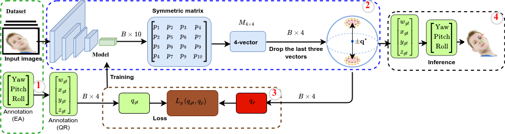
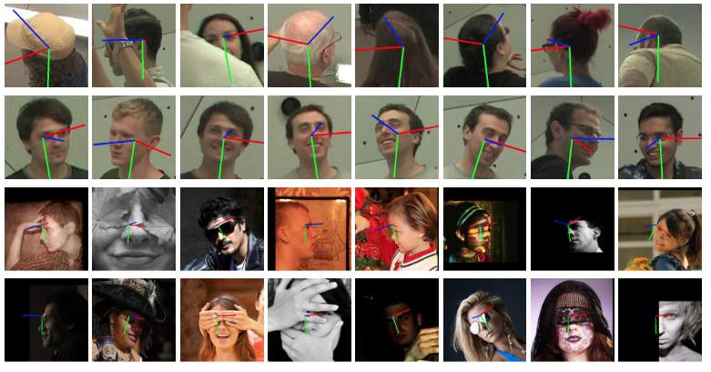

# ContQuat
**ContQuat: Continuous Quaternion Representation for Head Pose Estimation [here](https://www.sciencedirect.com/science/article/pii/S0020025526005529?via%3Dihub)**


<table>
<tr>
<td></td>

</tr>
</table>

* **Fig.**  Framework of the proposed ContQuat model.


# Results visualization


<table>
<tr>
<td></td>

</tr>
</table>

* **Fig.** Snapshots of different views.


## **Our results**
* **Table 1: MAE values for the CMU dataset obtained using different methods for Narrow-range angles: −90◦ < yaw < 90◦.**

| Method | Retrain | Rep. | Yaw ↓ | Pitch ↓ | Roll ↓ | MAE ↓ |
|--------|----------|------|--------|----------|---------|--------|
| DirectMHP [[1]](#ref1) | ✅ | E | 5.86 | 8.25 | 7.25 | 7.12 |
| DirectMHP [[1]](#ref1) | ❌ | E | 5.75 | 8.01 | 6.96 | 6.91 |
| 6DRepNet [[2]](#ref2) | ✅ | 6D | 5.20 | 7.22 | 6.00 | 6.14 |
| ContQuat (Ours) | ✅ | CQ | **4.64** | 6.84 | 5.54 | 5.67 |

* **Table 1: MAE values for the CMU dataset obtained using different methods for Full-range angles: −180◦ < yaw < 180◦.**

  
| Method | Retrain | Rep. | Yaw ↓ | Pitch ↓ | Roll ↓ | MAE ↓ |
|--------|----------|------|--------|----------|---------|--------|
| Viet et al. [[1]](#ref1) | ❌ | RM | 9.55 | 11.29 | 8.32 | 9.72 |
| WHENet [[2]](#ref2) | ❌ | E | 8.51 | 7.67 | 6.78 | 7.65 |
| DirectMHP [[3]](#ref3) | ✅ | E | 7.38 | 8.56 | 7.47 | 7.80 |
| DirectMHP [[3]](#ref3) | ❌ | E | 7.32 | 8.54 | 7.35 | 7.74 |
| Cobo et al. [[4]](#ref4) | ❌ | 6D | - | - | - | 7.45 |
| 6DRepNet [[5]](#ref5) | ✅ | 6D | 5.89 | 7.76 | 6.39 | 6.68 |
| ContQuat (Ours) | ✅ | CQ | **5.36** | **7.49** | **6.14** | **6.33** |


* **Table 2: MAE values for the BIWI and AFLW2000 datasets using different methods.**

| Method | Retrain | Rep. | AFLW2000 Yaw ↓ | AFLW2000 Pitch ↓ | AFLW2000 Roll ↓ | AFLW2000 MAE ↓ | BIWI Yaw ↓ | BIWI Pitch ↓ | BIWI Roll ↓ | BIWI MAE ↓ |
|--------|----------|------|----------------|------------------|-----------------|----------------|-------------|---------------|--------------|-------------|
| FSA-Net [[1]](#ref1) | ❌ | E | 4.50 | 6.08 | 4.64 | 5.07 | 4.27 | 4.96 | 2.76 | 4.00 |
| WHENet [[2]](#ref2) | ❌ | E | 4.44 | 5.75 | 4.31 | 4.83 | 3.60 | 4.10 | 2.73 | 3.48 |
| TokenHPE [[3]](#ref3) | ❌ | RM | 4.36 | 5.54 | 4.08 | 4.66 | 3.95 | 4.51 | 2.71 | 3.72 |
| QuatNet [[4]](#ref4) | ❌ | Q | 3.97 | 5.62 | 3.92 | 4.50 | 4.01 | 5.49 | 2.94 | 4.15 |
| LSR [[5]](#ref5) | ❌ | E | 4.26 | 5.27 | 3.89 | 4.47 | 4.29 | **3.09** | 3.18 | 3.52 |
| MFDNet [[6]](#ref6) | ❌ | RM | 4.30 | 5.16 | 3.69 | 4.38 | 3.40 | 4.68 | 2.77 | 3.62 |
| SRNet [[7]](#ref7) | ❌ | Q | 3.75 | 5.10 | 3.46 | 4.10 | 3.81 | 4.36 | 2.77 | 3.65 |
| DirectMHP [[8]](#ref8) | ❌ | E | **2.99** | 5.35 | 3.77 | 4.04 | 3.57 | 5.47 | 4.02 | 4.35 |
| Li et al. [[9]](#ref9) | ❌ | RM | 3.36 | 5.05 | 3.56 | 3.99 | 3.59 | 3.94 | 2.68 | **3.40** |
| 6DRepNet [[10]](#ref10) | ❌ | 6D | 3.63 | 4.91 | 3.37 | 3.97 | **3.24** | 4.48 | 2.68 | 3.47 |
| FSA-Net [[1]](#ref1) | ✅ | E | 5.41 | 6.82 | 5.42 | 5.88 | 4.74 | 5.32 | 3.26 | 4.44 |
| LSR [[5]](#ref5) | ✅ | E | 5.96 | 6.45 | 4.19 | 5.77 | 4.43 | 3.98 | 3.52 | 3.98 |
| 6DRepNet [[10]](#ref10) | ✅ | 6D | 3.50 | 4.81 | 3.47 | 3.93 | 3.79 | 4.53 | 2.89 | 3.74 |
| ContQuat (Ours) | ✅ | CQ | 3.36 | **4.69** | **3.31** | **3.79** | 3.91 | 4.43 | 2.69 | 3.68 |


# Datasets

* **CMU Panoptic**  from [here](http://domedb.perception.cs.cmu.edu/) for the full range angles.
  
* **300W-LP**, and **AFLW2000** from [here](http://www.cbsr.ia.ac.cn/users/xiangyuzhu/projects/3DDFA/main.htm) for the narrow range angles.

* **BIWI**  from [here](https://icu.ee.ethz.ch/research/datsets.html) for the narrow range angles.

  


## **For Training**:

If you **only** need to change the pre-trained RepVGG model '**RepVGG-B1g2-train.pth**' please see [here](https://drive.google.com/drive/folders/1Avome4KvNp0Lqh2QwhXO6L5URQjzCjUq) and save it in the root directory.


```
python3 train.py
```

After training is done. Next step.

##  **For Deploy models**:

For reparameterization, the trained models into inference models use the convert script.

```
python3 convert.py input-model.tar output-model.pth
```

After converting the training model into an inference model. 
Then, you can test your model.


## **For Testing**:

```
python3 test.py
```

If you are too lazy to do the above steps, you can download the pre-trained RepVGG model to run your application. 
'CMU_best.pth [here](https://drive.google.com/file/d/1EzVFYVCjFmZrbK3bwlyIvF2swtUWzdqd/view?usp=drive_link)' for the full range angles or '300_best.pth [here](https://drive.google.com/file/d/1n5SOdH8eg29vmE7uTRuUKzjAuM-Hl6Fe/view?usp=drive_link)' for narrow range angles.

# Citing

```
@article{abdu2026contquat,
  title={ContQuat: Continuous quaternion representation for head pose estimation},
  author={Abdu, Ahmed and Bae, Ji-Hun and Lee, Sungon and Algabri, Redhwan},
  journal={Information Sciences},
  pages={123621},
  year={2026},
  publisher={Elsevier}
}
```

